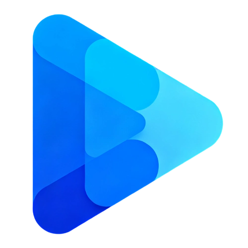

# 一起看 (Togother)

  

## 📱 项目简介

"一起看"是一款创新的视频同步观看应用，让用户可以与朋友、家人一起实时观看视频内容，共享欢乐时光。无论相隔多远，都能像坐在同一个沙发上一样，一起看电影、追剧、看直播。

> 欢迎大家来贡献规则👏 [https://github.com/pwxiao/TogotherRules](https://github.com/pwxiao/TogotherRules)

## ✨ 主要功能

- **💬 实时同步观看** - 所有人的视频进度完全同步，确保共同的观影体验
- **👨‍👩‍👧‍👦 多人观影房间** - 创建私密或公开房间，邀请好友一起观看
- **💬 实时聊天** - 边看边聊，分享观影感受
- **📺 支持多种视频源**
  - 🎬 在线视频资源
  - 🖥️ Emby 服务器
  - ☁️ 夸克网盘
  - 🔄 WebDAV/Alist
- **🔍 丰富的搜索功能** - 强大的搜索引擎，帮你找到想看的内容
- **🎮 播放控制功能**
  - ⏩ 最高支持 4 倍速播放
  - 💬 弹幕功能
  - 🔊 音轨切换
  - 💻 字幕设置
- **📱 画中画模式** - 支持后台播放和画中画观看
- **📺 投屏功能** - 支持投屏到大屏设备（会员专享）
- **💾 影片收藏** - 云端收藏喜爱的影片，随时随地观看
- **📊 观看历史** - 自动记录观看进度，无缝续播
- **🕵️ 视频嗅探功能** - 智能分析网页中的视频资源，提取视频源地址
- **📡 直播解析功能** - 获取抖音和哔哩哔哩平台的直播流，支持创建直播观看房间

## 📈 版本历史

查看 [完整更新日志](docs/changelog.md) 了解详细版本历史。

## 🛠️ 平台支持

- 📱 Android
- 📱 iOS
- 🖥️ windows
- 🖥️ mac

## 📸 应用截图

  <!-- 宽屏截图 -->
  

    
    
    
  

  
  <!-- 竖屏截图 -->
  

    
    
    
    
  

  
  

    
    
    
    
  

  
  

    
    
    
  

## ⚙️ 技术特点

- 🔄 实时同步技术，确保所有用户视频进度一致
- 🔒 安全的端到端通信
- 🚀 流畅的视频播放引擎
- 👥 稳定的多人房间架构
- 🎨 优雅直观的用户界面

## 📥 下载方式

访问我们的 [官方下载页面](docs/download.md) 获取最新版本。

## 🤝 支持与反馈

- 📚 [使用文档](docs/index.md)
- ❓ [常见问题](docs/help.md)
- 📧 联系邮箱: 203115061@qq.com
- 👥 用户交流群: 957528712
## 📄 用户协议与隐私

- [用户协议](docs/terms.md)
- [隐私政策](docs/privacy.md)

---

  
Copyright © 2025 一起看团队

